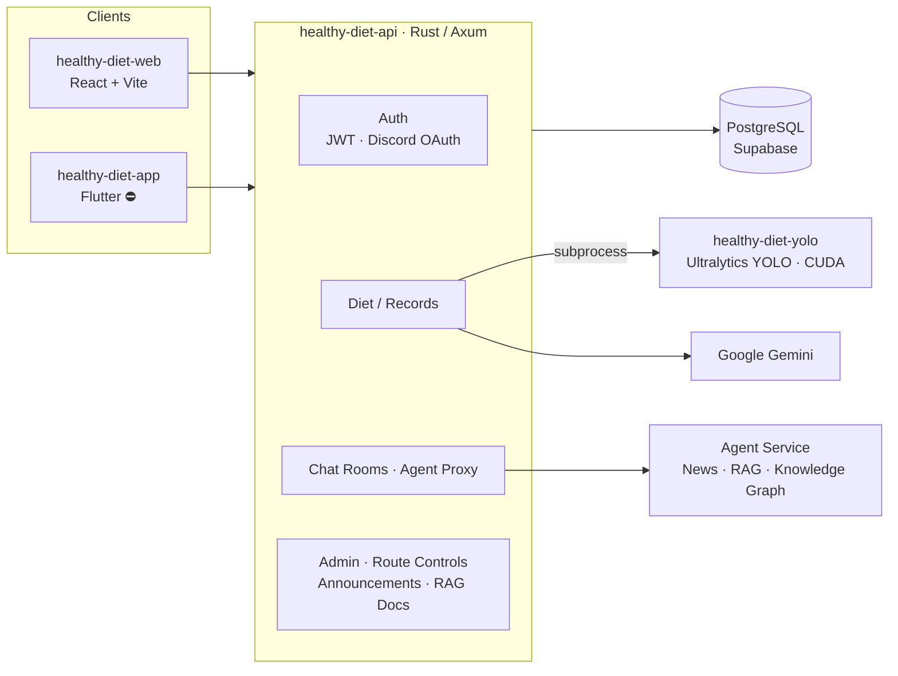

<div align="center">

# Healthy Diet

**結合 YOLO 電腦視覺與大型語言模型的智慧飲食管理系統：後端、AI 推論與行動端 Monorepo**

[](#️-專案狀態)
[](healthy-diet-api)
[](https://github.com/tokio-rs/axum)
[](https://supabase.com)
[](healthy-diet-yolo)
[](https://github.com/archie0732/healthy-diet-ai-agent)

[新版後端 healthy-diet-ai-agent](https://github.com/archie0732/healthy-diet-ai-agent) · [Web 前端 healthy-diet-web](https://github.com/archie0732/healthy-diet-web) · [線上展示](https://healthy-diet-web.vercel.app)

[English](README.md) · **繁體中文**

</div>

---

## ⚠️ 專案狀態

> [!WARNING]
> **本 repository 已於 2026-09 停止使用，不再維護。**
>
> 由於同時維護 Rust API、YOLO 推論、Flutter App 與 Agent 服務等多個專案的成本過高，團隊決定收斂架構：
> 本專案中的所有 API 已遷移至 **[`archie0732/healthy-diet-ai-agent`](https://github.com/archie0732/healthy-diet-ai-agent)**（⭐ 751+），後續開發、Issue 與 Pull Request 請一律移至該專案。

> [!NOTE]
> **Flutter 行動 App（`healthy-diet-app/`）已放棄開發。**
> 相關維護者時間上無法配合，App 停留在早期原型階段（登入、註冊、首頁與聊天頁骨架），不會再繼續開發。行動端需求由 [healthy-diet-web](https://github.com/archie0732/healthy-diet-web) 的響應式介面支援。

| 子專案 | 狀態 | 後續 |
| --- | --- | --- |
| `healthy-diet-api` — Rust API Server | ⚫ 停用（2026-09） | 由 [`healthy-diet-ai-agent`](https://github.com/archie0732/healthy-diet-ai-agent) 取代 |
| `healthy-diet-yolo` — YOLO 食物辨識 | ⚫ 停用 | 辨識能力整合至新版後端 |
| `healthy-diet-AIprompt` — Prompt 與資料集 | ⚫ 停用 | 僅供參考 |
| `healthy-diet-app` — Flutter App | ⛔ 已放棄 | 由 Web RWD 取代 |

以下內容保留作為架構參考與歷史紀錄。

---

## 目錄

- [專案簡介](#專案簡介)
- [系統架構](#系統架構)
- [Repository 結構](#repository-結構)
- [子專案說明](#子專案說明)
- [API 概覽](#api-概覽)
- [本機執行（歷史版本）](#本機執行歷史版本)
- [環境變數](#環境變數)
- [遷移指南](#遷移指南)

## 專案簡介

Healthy Diet 讓使用者只要**拍下一張餐點照片**，就能：

1. 由 **YOLO** 物件偵測模型辨識餐點中的食物並估算份量；
2. 換算熱量與六大類營養素，寫入個人飲食紀錄；
3. 結合使用者的身高體重、疾病史與過敏原，由 **LLM（Google Gemini / Gemma）** 產生個人化的營養評分與建議；
4. 透過 **AI Agent 聊天室**與 **RAG 知識庫 / 知識圖譜**，隨時諮詢營養相關問題。

本 monorepo 承載了系統的後端、AI 推論與行動端；Web 前端則位於獨立的 [healthy-diet-web](https://github.com/archie0732/healthy-diet-web)。

## 系統架構



## Repository 結構

```text
healthy-diet/
├── healthy-diet-api/        # Rust (Axum) API Server
│   ├── src/
│   │   ├── api/             # 各路由 handler：auth、diet、chat、admin、rag、knowledge graph…
│   │   ├── discord/         # Discord OAuth 登入
│   │   ├── utils/           # JWT、Argon2 雜湊、Gemini client、BMI/BMR 計算、路由開關…
│   │   ├── router.rs        # 路由、CORS、Tracing middleware
