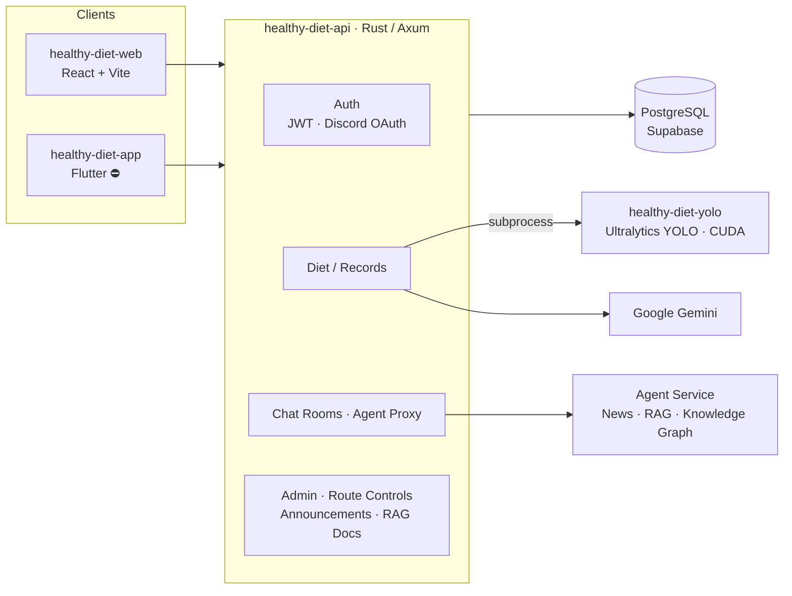

<div align="center">

# Healthy Diet

**A smart diet-tracking system that pairs YOLO computer vision with large language models. This monorepo holds its backend, AI inference and mobile client.**

[](#️-project-status)
[](healthy-diet-api)
[](https://github.com/tokio-rs/axum)
[](https://supabase.com)
[](healthy-diet-yolo)
[](https://github.com/archie0732/healthy-diet-ai-agent)

[New backend: healthy-diet-ai-agent](https://github.com/archie0732/healthy-diet-ai-agent) · [Web frontend: healthy-diet-web](https://github.com/archie0732/healthy-diet-web) · [Live Demo](https://healthy-diet-web.vercel.app)

**English** · [繁體中文](README.zh-TW.md)

</div>

---

## ⚠️ Project Status

> [!WARNING]
> **This repository was retired in September 2026 and is no longer maintained.**
>
> Maintaining the Rust API, YOLO inference, Flutter app and agent service as separate projects became too costly, so the team consolidated the architecture.
> Every API in this repository has moved to **[`archie0732/healthy-diet-ai-agent`](https://github.com/archie0732/healthy-diet-ai-agent)** (⭐ 751+). Please direct all further development, issues and pull requests there.

> [!NOTE]
> **The Flutter mobile app (`healthy-diet-app/`) has been discontinued.**
> Its maintainers could not commit the time, so the app stopped at an early prototype (skeletons for login, registration, home and chat) and will not be developed further. Mobile users are served by the responsive UI of [healthy-diet-web](https://github.com/archie0732/healthy-diet-web).

| Sub-project | Status | Replacement |
| --- | --- | --- |
| `healthy-diet-api`: Rust API server | ⚫ Retired (2026-09) | Replaced by [`healthy-diet-ai-agent`](https://github.com/archie0732/healthy-diet-ai-agent) |
| `healthy-diet-yolo`: YOLO food recognition | ⚫ Retired | Recognition folded into the new backend |
| `healthy-diet-AIprompt`: prompts and datasets | ⚫ Retired | Kept for reference only |
| `healthy-diet-app`: Flutter app | ⛔ Discontinued | Replaced by the responsive web UI |

Everything below is kept as an architectural reference and historical record.

---

## Table of Contents

- [Overview](#overview)
- [Architecture](#architecture)
- [Repository Layout](#repository-layout)
- [Sub-projects](#sub-projects)
- [API Overview](#api-overview)
- [Running Locally (Legacy)](#running-locally-legacy)
- [Environment Variables](#environment-variables)
- [Migration Guide](#migration-guide)

## Overview

With Healthy Diet, a user **takes one photo of a meal** and the system:

1. detects each food item and estimates its portion with a **YOLO** object-detection model;
2. converts it into calories and the six major food groups, then saves it to the user's diet log;
3. combines height, weight, medical history and allergies to produce a personalized nutrition score and advice with an **LLM (Google Gemini / Gemma)**;
4. lets the user ask nutrition questions at any time through an **AI agent chat** backed by a **RAG knowledge base and knowledge graph**.

This monorepo contains the backend, AI inference and mobile client. The web frontend lives separately in [healthy-diet-web](https://github.com/archie0732/healthy-diet-web).

## Architecture



## Repository Layout

```text
healthy-diet/
├── healthy-diet-api/        # Rust (Axum) API server
│   ├── src/
│   │   ├── api/             # Route handlers: auth, diet, chat, admin, RAG, knowledge graph…
│   │   ├── discord/         # Discord OAuth login
│   │   ├── utils/           # JWT, Argon2 hashing, Gemini client, BMI/BMR, route controls…
│   │   ├── router.rs        # Routes, CORS, tracing middleware
│   │   └── main.rs
│   ├── .sqlx/               # SQLx offline query cache (compiles without a live DB)
│   ├── docs/                # Supabase schema and performance-tuning SQL
│   ├── openapi.yml          # OpenAPI 3 specification
│   ├── Dockerfile           # Multi-stage build: Rust build → CUDA runtime + YOLO
│   └── compose.yaml         # Includes an NVIDIA GPU reservation
├── healthy-diet-yolo/       # YOLO food-recognition CLI (outputs standard JSON)
├── healthy-diet-AIprompt/   # Prompt config, nutrition database and test data
├── healthy-diet-app/        # Flutter app (discontinued)
└── healthy-diet.code-workspace
```

## Sub-projects

### `healthy-diet-api`: Rust API server

A high-performance async API built with **Rust, Axum and Tokio**:

- **Authentication**: email/password (Argon2 hashing) and Discord OAuth2, with access and refresh JWTs and separate user and admin roles.
- **Meal recognition**: takes an image, runs the YOLO inference script, sends the result to Gemini for nutrition analysis and scoring, and stores it in PostgreSQL.
- **AI agent proxy**: multiple chat rooms and history. Profile updates the agent suggests must be approved by the user (human-in-the-loop).
- **Knowledge services**: news sync, RAG semantic search, knowledge graph queries and source-evidence lookup.
- **Operations console**: user management, announcements, RAG document upload and re-indexing, and **route controls** that switch off expensive features at runtime.
- **Engineering quality**: compile-time-checked SQL with SQLx (including offline mode), structured tracing logs, a configurable CORS allowlist, a 25 MB request limit and router-level integration tests.

See [`healthy-diet-api/readme.md`](healthy-diet-api/readme.md) for details.

### `healthy-diet-yolo`: food recognition

A CLI built on Ultralytics YOLO. It takes an image and outputs standard JSON with class, confidence and bounding box for each detection, plus an annotated result image. The API server calls it as a subprocess, and the Docker image ships a CUDA runtime for GPU inference.

See [`healthy-diet-yolo/README.md`](healthy-diet-yolo/README.md) for details.

### `healthy-diet-AIprompt`: prompts and data

Holds the LLM system prompts (`AIPrompt.json`), a nutrition database, test personas and YOLO weights, used to iterate on prompts and validate the model.

### `healthy-diet-app`: Flutter app (discontinued)

A mobile prototype built with Flutter, go_router, Provider and Dio / Retrofit. It has the basic structure for login, registration, an intro page, home and chat. Development stopped because its maintainers could not commit the time.

## API Overview

The full specification is in [`healthy-diet-api/openapi.yml`](healthy-diet-api/openapi.yml). A running server also serves it at `GET /openapi.yml`.

| Area | Main routes |
| --- | --- |
| Auth | `POST /auth/register`, `POST /auth/login`, `POST /auth/admin/login`, `POST /api/auth/refresh`, `GET /auth/discord/login` |
| User | `GET` / `PUT /api/user/profile` |
| Diet | `POST /api/diet`, `POST /api/diet_image`, `GET /api/diet_record`, `GET /api/month_stats` |
| Chat / Agent | `POST /api/chat`, `POST /api/approve`, `GET /api/chat_rooms`, `GET /api/chat_room_titles`, `GET /api/room_history/{room_id}` |
| Knowledge | `GET /api/news`, `POST /api/news/sync`, `GET` / `POST /api/rag/search`, `/api/knowledge-graph/*` |
| System | `GET /api/health`, `GET /api/ping`, `GET /api/gemma4/health`, `GET /api/announcements/current` |
| Admin | `/admin/users`, `/admin/route-controls`, `/admin/announcements`, `/admin/rag/documents` |

## Running Locally (Legacy)

> These steps document the old architecture for reference only. For new work, use [`healthy-diet-ai-agent`](https://github.com/archie0732/healthy-diet-ai-agent).

### Docker Compose (recommended)

Requires Docker and the NVIDIA Container Toolkit:

```bash
git clone https://github.com/PU-Hub/healthy-diet.git
cd healthy-diet/healthy-diet-api
# Create a .env file as described in "Environment Variables"
docker compose up --build
```

The API listens on `http://localhost:3000` by default.

### Native

```bash
# 1. YOLO inference dependencies
pip install -r healthy-diet-yolo/requirements.txt

# 2. API server
cd healthy-diet-api
# Run the schema SQL in docs/ against Supabase / PostgreSQL first
cargo run --release

# 3. Tests
cargo test
```

## Environment Variables

| Variable | Description |
| --- | --- |
| `PORT` | Listening port (default `3000`) |
| `DATABASE_URL` | PostgreSQL connection string (Supabase transaction pool) |
| `DATABASE_URL_2` | Connection string for migrations (session pool / direct) |
| `JWT_SECRET` | JWT signing secret |
| `GEMINI_API_KEY` | Google Gemini API key |
| `AGENT_API_URL` | Downstream agent service URL (chat, news, RAG, knowledge graph) |
| `CORS_ALLOWED_ORIGINS` | Comma-separated allowed origins. If unset, the production site and `localhost:5173` are allowed. |
| `DISCORD_CLIENT_ID` / `DISCORD_CLIENT_SECRET` / `DISCORD_REDIRECT_URL` | Discord OAuth settings |
| `YOLO_SCRIPT_PATH` | Path to the YOLO `predict.py` script |
| `CHAT_IMAGE_UPLOAD_DIR` | Upload directory for chat images |
| `RAG_DOCS_ROOT` | Root directory for RAG documents |
| `RUST_LOG` | Log level (default `info,sqlx=warn`) |

## Migration Guide

If you still depend on this repository's API:

1. Deploy [`archie0732/healthy-diet-ai-agent`](https://github.com/archie0732/healthy-diet-ai-agent) instead, configured as its README describes.
2. For the web frontend ([healthy-diet-web](https://github.com/archie0732/healthy-diet-web)), just point `VITE_API_BASE` at the new service URL.
3. Import your database and RAG documents following the new project's instructions.
4. Open new issues, feature requests and pull requests against the new project. This repository no longer accepts them.

## Acknowledgements

Thanks to every PU-Hub member who worked on the Healthy Diet backend, AI models, mobile app and data curation. This repository is where Healthy Diet began, and it laid the foundation for [`healthy-diet-ai-agent`](https://github.com/archie0732/healthy-diet-ai-agent).

<div align="center">
<sub>Healthy Diet development continues in <a href="https://github.com/archie0732/healthy-diet-ai-agent">healthy-diet-ai-agent</a>. Stars are appreciated ⭐</sub>
</div>
