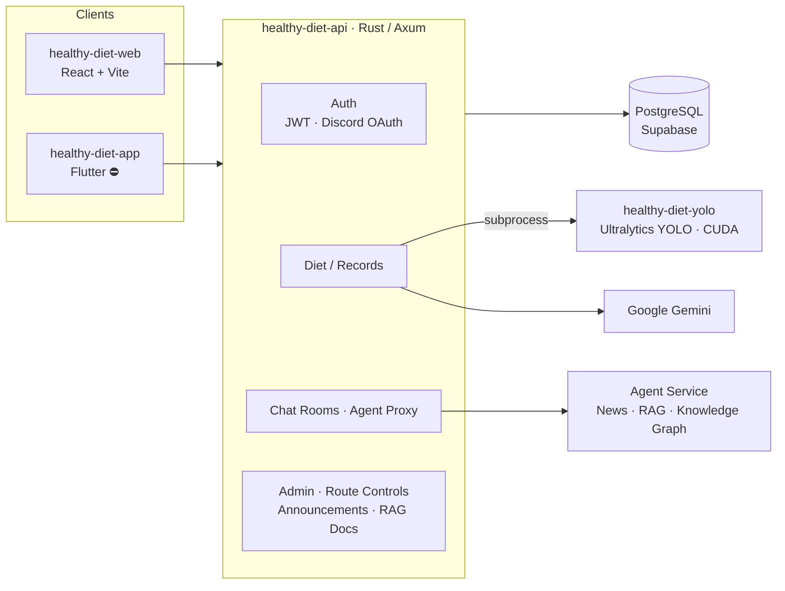

<div align="center">

# Healthy Diet

**A smart diet-tracking system that pairs YOLO computer vision with large language models. This monorepo holds its backend, AI inference and mobile client.**

[](#️-project-status)
[](healthy-diet-api)
[](https://github.com/tokio-rs/axum)
[](https://supabase.com)
[](healthy-diet-yolo)
[](https://github.com/archie0732/healthy-diet-ai-agent)

[New backend: healthy-diet-ai-agent](https://github.com/archie0732/healthy-diet-ai-agent) · [Web frontend: healthy-diet-web](https://github.com/archie0732/healthy-diet-web) · [Live Demo](https://healthy-diet-web.vercel.app)

**English** · [繁體中文](README.zh-TW.md)

</div>

---

## ⚠️ Project Status

> [!WARNING]
> **This repository was retired in September 2026 and is no longer maintained.**
>
> Maintaining the Rust API, YOLO inference, Flutter app and agent service as separate projects became too costly, so the team consolidated the architecture.
> Every API in this repository has moved to **[`archie0732/healthy-diet-ai-agent`](https://github.com/archie0732/healthy-diet-ai-agent)** (⭐ 751+). Please direct all further development, issues and pull requests there.

> [!NOTE]
> **The Flutter mobile app (`healthy-diet-app/`) has been discontinued.**
> Its maintainers could not commit the time, so the app stopped at an early prototype (skeletons for login, registration, home and chat) and will not be developed further. Mobile users are served by the responsive UI of [healthy-diet-web](https://github.com/archie0732/healthy-diet-web).

| Sub-project | Status | Replacement |
| --- | --- | --- |
| `healthy-diet-api`: Rust API server | ⚫ Retired (2026-09) | Replaced by [`healthy-diet-ai-agent`](https://github.com/archie0732/healthy-diet-ai-agent) |
| `healthy-diet-yolo`: YOLO food recognition | ⚫ Retired | Recognition folded into the new backend |
| `healthy-diet-AIprompt`: prompts and datasets | ⚫ Retired | Kept for reference only |
| `healthy-diet-app`: Flutter app | ⛔ Discontinued | Replaced by the responsive web UI |

Everything below is kept as an architectural reference and historical record.

---

## Table of Contents

- [Overview](#overview)
- [Architecture](#architecture)
- [Repository Layout](#repository-layout)
- [Sub-projects](#sub-projects)
- [API Overview](#api-overview)
- [Running Locally (Legacy)](#running-locally-legacy)
- [Environment Variables](#environment-variables)
- [Migration Guide](#migration-guide)

## Overview

With Healthy Diet, a user **takes one photo of a meal** and the system:

1. detects each food item and estimates its portion with a **YOLO** object-detection model;
2. converts it into calories and the six major food groups, then saves it to the user's diet log;
3. combines height, weight, medical history and allergies to produce a personalized nutrition score and advice with an **LLM (Google Gemini / Gemma)**;
4. lets the user ask nutrition questions at any time through an **AI agent chat** backed by a **RAG knowledge base and knowledge graph**.

This monorepo contains the backend, AI inference and mobile client. The web frontend lives separately in [healthy-diet-web](https://github.com/archie0732/healthy-diet-web).

## Architecture



## Repository Layout

```text
healthy-diet/
├── healthy-diet-api/        # Rust (Axum) API server
│   ├── src/
│   │   ├── api/             # Route handlers: auth, diet, chat, admin, RAG, knowledge graph…
│   │   ├── discord/         # Discord OAuth login
│   │   ├── utils/           # JWT, Argon2 hashing, Gemini client, BMI/BMR, route controls…
│   │   ├── router.rs        # Routes, CORS, tracing middleware
